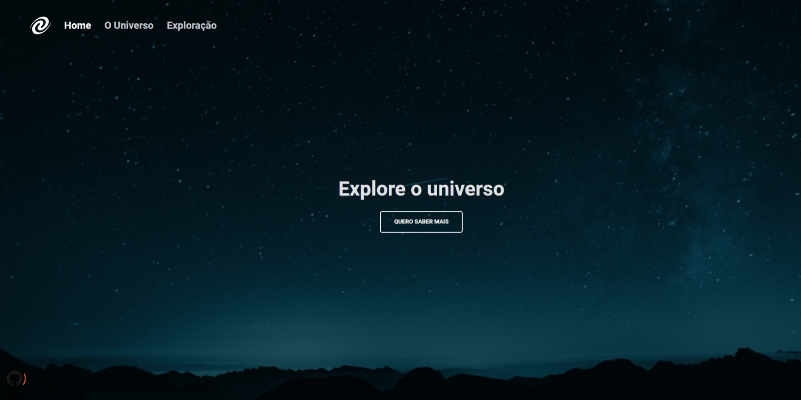

# SPA Universe

A ideia agora é desenvolver um aaplicação aplicando o conceito basico do SPA
O que será abordado nesse desafio:

- Conceitos de SPA;
- Mapeamento de rotas;
- Assíncrono e promises;
- Orientação a objetos;
- Classes e muito mais.

## Layout da aplicação

Aqui neste **[link](<hhttps://www.figma.com/file/m8zp3mtxvwyTGQs69nIFM8/%5BDesafios-Explorer%5D-SPA-Universe/duplicate>)** você tem acesso ao Figma do projeto**.** Abaixo você pode ver como a aplicação deve ficar:

## Deploy

Para Acessa o projeto 

  
- Desafio proposto
